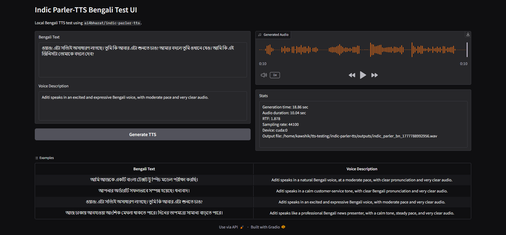
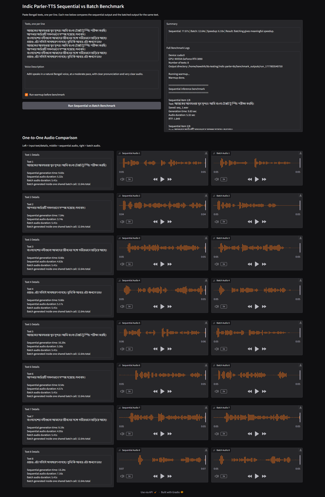

# Indic Parler-TTS Execution Documentation

**Indic-Parler-TTS** is a text-to-speech model for Indic languages, built on the Parler-TTS architecture. It generates natural-sounding speech from text input with controllable voice characteristics through descriptive prompts.

**Links:**
- Hugging Face: https://huggingface.co/ai4bharat/indic-parler-tts
- GitHub Repository: https://github.com/huggingface/parler-tts

---

A complete A-to-Z guide for setting up, running, and benchmarking **Indic Parler-TTS** for TTS inference with:

- Gradio single-text UI
- Gradio sequential vs model-level batch benchmark UI
- Hugging Face gated model access
- GPU setup notes

## 1. System Assumptions

Tested environment:

```text
GPU: NVIDIA GeForce RTX 3090
CUDA visible device: 1
Python env: your-env
PyTorch: 2.3.1+cu121
Transformers: 4.46.1
```

**Project files:**

- `requirements.txt` — Python package dependencies for Indic Parler-TTS inference and Gradio UI
- `.python-version` — specifies Python 3.10.14 (for pyenv users)

Important GPU mapping note:

```text
If CUDA_VISIBLE_DEVICES=1 is set, physical GPU 1 becomes logical cuda:0 inside Python.
So seeing cuda:0 in PyTorch logs is expected and correct.
```

---

## 2. Go to Project Folder

From the server:

```bash
cd indic-parler-tts
```

Create output/cache folders:

```bash
mkdir -p ./outputs ./benchmark_outputs ./gradio_tmp
```

---

## 3. Activate Python Environment

Existing environment used:

```bash
conda activate your-env
```

If using `venv` instead of conda, activate your venv accordingly:

```bash
source /path/to/venv/bin/activate
```

---

## 4. Select GPU

Use physical GPU 1:

```bash
export CUDA_VISIBLE_DEVICES=1
```

Verify:

```bash
echo $CUDA_VISIBLE_DEVICES
```

Expected:

```text
1
```

---

## 5. Check CUDA and PyTorch

Run:

```bash
python - <<'PY'
import torch

print("torch:", torch.__version__)
print("cuda available:", torch.cuda.is_available())
print("cuda device count:", torch.cuda.device_count())

if torch.cuda.is_available():
    print("visible gpu:", torch.cuda.get_device_name(0))
PY
```

Expected working output:

```text
torch: 2.3.1+cu121
cuda available: True
cuda device count: 1
visible gpu: NVIDIA GeForce RTX 3090
```

Again, `cuda:0` means the first visible GPU inside the process, not necessarily physical GPU 0.

---

## 6. Install Required Packages

Install all dependencies from `requirements.txt`:

```bash
pip install -r requirements.txt
```

## 7. Verify Python Imports

Run:

```bash
python - <<'PY'
import torch
import transformers
import soundfile
import gradio
from parler_tts import ParlerTTSForConditionalGeneration

print("torch:", torch.__version__)
print("transformers:", transformers.__version__)
print("cuda:", torch.cuda.is_available())
print("gpu:", torch.cuda.get_device_name(0) if torch.cuda.is_available() else "none")
print("Parler-TTS import OK")
print("Gradio import OK")
PY
```

Example successful output:

```text
Flash attention 2 is not installed
torch: 2.3.1+cu121
transformers: 4.46.1
cuda: True
gpu: NVIDIA GeForce RTX 3090
Parler-TTS import OK
Gradio import OK
```

The message below is only a speed warning, not a correctness issue:

```text
Flash attention 2 is not installed
```

---

## 8. Hugging Face Authentication

Indic Parler-TTS is a gated Hugging Face model.

Model page:

```text
https://huggingface.co/ai4bharat/indic-parler-tts
```

Open the model page in a browser while logged in to Hugging Face and click:

```text
Agree and access repository
```

Then login from the server:

```bash
huggingface-cli login
```

Paste a Hugging Face **Read** token.

Verify login:

```bash
huggingface-cli whoami
```

---

## 9. Test Hugging Face Gated Model Access

Run:

```bash
python - <<'PY'
from huggingface_hub import hf_hub_download

path = hf_hub_download(
    repo_id="ai4bharat/indic-parler-tts",
    filename="config.json",
)

print("Access OK:", path)
PY
```

Expected:

```text
Access OK: /home/kawshik/.cache/huggingface/hub/models--ai4bharat--indic-parler-tts/snapshots/.../config.json
```

If you see:

```text
401 Unauthorized
```

you are not logged in.

If you see:

```text
403 Forbidden
not in the authorized list
```

you have logged in but have not accepted/requested access on the Hugging Face model page.

---

## 10. Hugging Face Cache Location

The model is downloaded to the default Hugging Face cache:

```bash
/home/kawshik/.cache/huggingface/hub/
```

Indic Parler-TTS cache path:

```bash
/home/kawshik/.cache/huggingface/hub/models--ai4bharat--indic-parler-tts/
```

Inspect:

```bash
ls -lh ~/.cache/huggingface/hub/models--ai4bharat--indic-parler-tts/
ls -lh ~/.cache/huggingface/hub/models--ai4bharat--indic-parler-tts/snapshots/
du -sh ~/.cache/huggingface/hub/models--ai4bharat--indic-parler-tts/
```

After the first successful download, future runs usually load from cache and do not download again.

Optional offline mode after all needed files are cached:

```bash
export HF_HUB_OFFLINE=1
export TRANSFORMERS_OFFLINE=1
```

---

## 11. Single Inference Script

File: [`test_indic_parler_bn.py`](test_indic_parler_bn.py)

Purpose:

```text
Generate one Bengali TTS WAV file from Python.
```

Run:

```bash
cd indic-parler-tts
conda activate your-env
export CUDA_VISIBLE_DEVICES=1

python test_indic_parler_bn.py
```

Expected generated file:

```text
indic_parler_bn_test.wav
```

Check:

```bash
ls -lh indic_parler_bn_test.wav
```

Example successful output:

```text
Saved: indic_parler_bn_test.wav
Sampling rate: 44100
Audio duration: 5.77 sec
Generation time: 11.62 sec
RTF: 2.013
```

---

## 12. Run Single-Text Gradio UI

File: [`indic_parler_ui.py`](indic_parler_ui.py)

Purpose:

```text
A browser UI for generating one Bengali TTS output at a time.
```



Create required folders:

```bash
cd indic-parler-tts
mkdir -p ./gradio_tmp ./outputs
```

Run:

```bash
cd indic-parler-tts
conda activate your-env

export CUDA_VISIBLE_DEVICES=1
export TMPDIR=/home/kawshik/tts-testing/indic-parler-tts/gradio_tmp
export GRADIO_TEMP_DIR=/home/kawshik/tts-testing/indic-parler-tts/gradio_tmp

python indic_parler_ui.py
```

Expected:

```text
Model loaded.
Running on local URL: http://0.0.0.0:6010
```

Example generation log:

```text
Generation time: 18.86 sec
Audio duration: 10.04 sec
RTF: 1.878
Sampling rate: 44100
Device: cuda:0
Output file: /home/kawshik/tts-testing/indic-parler-tts/outputs/indic_parler_bn_1777788992956.wav
```

Open from browser:

```text
http://YOUR_SERVER_IP:6010
```

Generated WAV files are stored here:

```bash
/home/kawshik/tts-testing/indic-parler-tts/outputs/
```

Check:

```bash
ls -lh /home/kawshik/tts-testing/indic-parler-tts/outputs/
```

---

## 13. Run Sequential vs Batch Benchmark UI

File: [`indic_parler_benchmark_ui.py`](indic_parler_benchmark_ui.py)

Purpose:

```text
Compare N texts generated sequentially vs N texts generated in one model-level batch call.
```



Create required folders:

```bash
cd indic-parler-tts
mkdir -p ./gradio_tmp ./benchmark_outputs
```

Run:

```bash
cd indic-parler-tts
conda activate your-env

export CUDA_VISIBLE_DEVICES=1
export TMPDIR=/home/kawshik/tts-testing/indic-parler-tts/gradio_tmp
export GRADIO_TEMP_DIR=/home/kawshik/tts-testing/indic-parler-tts/gradio_tmp

python indic_parler_benchmark_ui.py
```

Expected:

```text
Model loaded.
Running on local URL: http://0.0.0.0:6011
```

Open from browser:

```text
http://YOUR_SERVER_IP:6011
```

Benchmark outputs are stored here:

```bash
/home/kawshik/tts-testing/indic-parler-tts/benchmark_outputs/
```

Each run creates a folder:

```text
benchmark_outputs/run_<timestamp>/
```

Example files inside:

```text
seq_1.wav
seq_2.wav
seq_3.wav
seq_4.wav
batch_1.wav
batch_2.wav
batch_3.wav
batch_4.wav
```

Check:

```bash
ls -lh /home/kawshik/tts-testing/indic-parler-tts/benchmark_outputs/
```

---

## 14. Benchmark UI Behavior

The benchmark UI provides one-to-one comparison:

```text
Text 1 Details | Sequential Audio 1 | Batch Audio 1
Text 2 Details | Sequential Audio 2 | Batch Audio 2
Text 3 Details | Sequential Audio 3 | Batch Audio 3
Text 4 Details | Sequential Audio 4 | Batch Audio 4
```

It reports:

```text
Sequential wall time
Batch wall time
Speedup
Sequential throughput
Batch throughput
Sequential RTF
Batch RTF
```

### Example Output

```text
Device: cuda:0
GPU: NVIDIA GeForce RTX 3090
Number of texts: 8
Output directory: /home/kawshik/tts-testing/indic-parler-tts/benchmark_outputs/run_1777803540750

Running warmup...
Warmup done.

==============================
Sequential inference benchmark
==============================

Sequential item 1/8
Text: আজকের আবহাওয়া খুব সুন্দর। আমি বাংলা টেক্সট টু স্পিচ পরীক্ষা করছি।
Saved: seq_1.wav
Generation time: 9.83 sec
Audio duration: 5.32 sec
RTF: 1.849

Sequential item 2/8
Text: আপনার অর্ডারটি সফলভাবে সম্পন্ন হয়েছে। ধন্যবাদ।
Saved: seq_2.wav
Generation time: 7.04 sec
Audio duration: 3.74 sec
RTF: 1.883

Sequential item 3/8
Text: বাংলাদেশের নদীগুলো আমাদের জীবনের সঙ্গে গভীরভাবে জড়িয়ে আছে।
Saved: seq_3.wav
Generation time: 8.66 sec
Audio duration: 4.63 sec
RTF: 1.869

Sequential item 4/8
Text: ওয়াও! এটা সত্যিই অসাধারণ লাগছে। তুমি কি আবার এটা শুনতে চাও?
Saved: seq_4.wav
Generation time: 9.66 sec
Audio duration: 5.17 sec
RTF: 1.870

Sequential item 5/8
Text: আজকের আবহাওয়া খুব সুন্দর। আমি বাংলা টেক্সট টু স্পিচ পরীক্ষা করছি।
Saved: seq_5.wav
Generation time: 10.29 sec
Audio duration: 5.56 sec
RTF: 1.850

Sequential item 6/8
Text: আপনার অর্ডারটি সফলভাবে সম্পন্ন হয়েছে। ধন্যবাদ।
Saved: seq_6.wav
Generation time: 8.54 sec
Audio duration: 4.57 sec
RTF: 1.867

Sequential item 7/8
Text: বাংলাদেশের নদীগুলো আমাদের জীবনের সঙ্গে গভীরভাবে জড়িয়ে আছে।
Saved: seq_7.wav
Generation time: 9.19 sec
Audio duration: 4.95 sec
RTF: 1.858

Sequential item 8/8
Text: ওয়াও! এটা সত্যিই অসাধারণ লাগছে। তুমি কি আবার এটা শুনতে চাও?
Saved: seq_8.wav
Generation time: 13.24 sec
Audio duration: 7.16 sec
RTF: 1.849

--- Sequential Summary ---
Total wall time: 77.07 sec
Average item generation time: 9.56 sec
Total audio duration: 41.10 sec
Audio seconds / wall second: 0.53
Overall RTF: 1.875

==============================
Model-level batch benchmark
==============================
description input_ids shape: (8, 27)
prompt input_ids shape: (8, 21)
Generation tensor shape: (8, 238592)
Saved: batch_1.wav
Batch audio duration 1: 5.41 sec
Saved: batch_2.wav
Batch audio duration 2: 5.41 sec
Saved: batch_3.wav
Batch audio duration 3: 5.41 sec
Saved: batch_4.wav
Batch audio duration 4: 5.41 sec
Saved: batch_5.wav
Batch audio duration 5: 5.41 sec
Saved: batch_6.wav
Batch audio duration 6: 5.41 sec
Saved: batch_7.wav
Batch audio duration 7: 5.41 sec
Saved: batch_8.wav
Batch audio duration 8: 5.41 sec

--- Batch Summary ---
Batch size: 8
Batch wall time: 12.64 sec
Total audio duration: 43.28 sec
Audio seconds / wall second: 3.42
Overall RTF: 0.292

==============================
Final Comparison
==============================
Sequential wall time: 77.07 sec
Batch wall time:      12.64 sec
Speedup:              6.10x

Sequential throughput: 0.53 audio-sec/wall-sec
Batch throughput:      3.42 audio-sec/wall-sec

Sequential RTF: 1.875
Batch RTF:      0.292

Result: Batching gives meaningful speedup.
```

---

## 15. Warmup Benchmark Option

The benchmark UI has:

```text
Run warmup before benchmark
```

This runs one small dummy TTS generation before timing the actual benchmark.

Warmup removes first-run overhead such as:

```text
CUDA kernel initialization
PyTorch/CUDA memory allocation
GPU clock ramp-up
lazy internal setup
```

Use warmup when comparing normal serving performance.

Disable warmup only when measuring cold-start latency.

---

## 16. Voice Description

Indic Parler-TTS uses two inputs:

```text
1. Bengali Text      -> what to say
2. Voice Description -> how to say it
```

Example:

```text
Aditi speaks in a natural Bengali voice, at a moderate pace, with clear pronunciation and very clear audio.
```

The voice description can affect:

```text
speaker style
tone
speed
emotion
clarity
audio quality
```

Example descriptions:

```text
Aditi speaks in a calm customer-service tone, with clear Bengali pronunciation and very clear audio.
```

```text
Aditi speaks like a professional Bengali news presenter, with a steady pace and very clear audio.
```

```text
Aditi speaks in an excited and expressive Bengali voice, with moderate pace and very clear audio.
```

For benchmark accuracy, keep the same voice description for all runs.

---

## 17. Generated Audio Storage

Single UI outputs:

```bash
/home/kawshik/tts-testing/indic-parler-tts/outputs/
```

Benchmark UI outputs:

```bash
/home/kawshik/tts-testing/indic-parler-tts/benchmark_outputs/
```

Gradio temporary files:

```bash
/home/kawshik/tts-testing/indic-parler-tts/gradio_tmp/
```

Clear generated outputs:

```bash
rm -rf /home/kawshik/tts-testing/indic-parler-tts/outputs/*
rm -rf /home/kawshik/tts-testing/indic-parler-tts/benchmark_outputs/*
rm -rf /home/kawshik/tts-testing/indic-parler-tts/gradio_tmp/*
```

---

## 18. Gradio Temp Permission Issue

If this error appears:

```text
PermissionError: [Errno 13] Permission denied: '/tmp/gradio/...'
```

Use project-local temp folders:

```bash
cd indic-parler-tts
mkdir -p ./gradio_tmp ./outputs ./benchmark_outputs

export TMPDIR=/home/kawshik/tts-testing/indic-parler-tts/gradio_tmp
export GRADIO_TEMP_DIR=/home/kawshik/tts-testing/indic-parler-tts/gradio_tmp
```

The UI code should also set:

```python
os.environ["TMPDIR"] = str(GRADIO_TMP_DIR)
os.environ["GRADIO_TEMP_DIR"] = str(GRADIO_TMP_DIR)
```

---

## 19. Common Warnings and Errors

### FlashAttention warning

```text
Flash attention 2 is not installed
```

This is only a performance warning. Inference can still work.

### Hugging Face 401

```text
401 Unauthorized
```

Cause:

```text
Not logged in to Hugging Face on the server.
```

Fix:

```bash
huggingface-cli login
```

### Hugging Face 403

```text
403 Forbidden
not in the authorized list
```

Cause:

```text
Logged in, but model access has not been accepted/approved.
```

Fix:

```text
Open https://huggingface.co/ai4bharat/indic-parler-tts
Click "Agree and access repository"
```

### Gradio `/tmp/gradio` permission error

Fix:

```bash
export TMPDIR=/home/kawshik/tts-testing/indic-parler-tts/gradio_tmp
export GRADIO_TEMP_DIR=/home/kawshik/tts-testing/indic-parler-tts/gradio_tmp
```

## Prepared By
**Kawshik Kumar Paul**  
Software Engineer | Researcher  
Department of Computer Science and Engineering (CSE)  
Bangladesh University of Engineering and Technology (BUET)  
**Email:** kawshikbuet17@gmail.com  