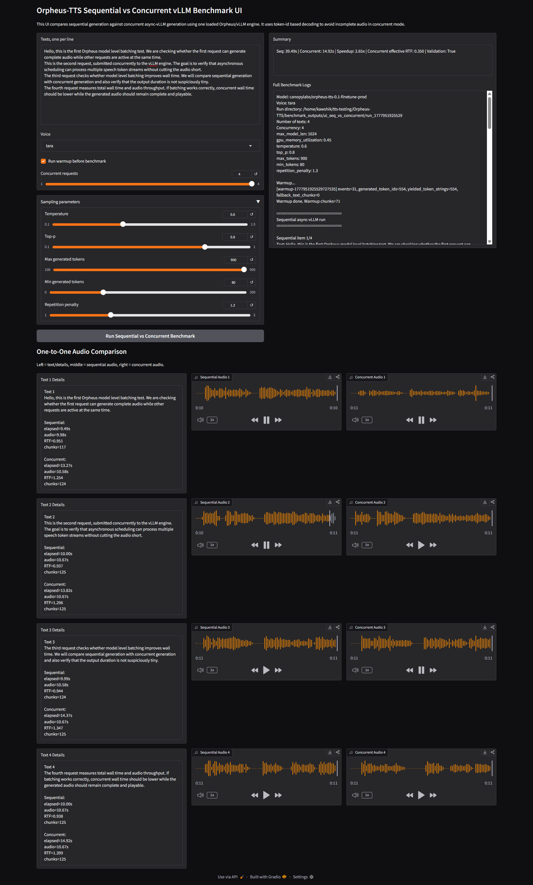
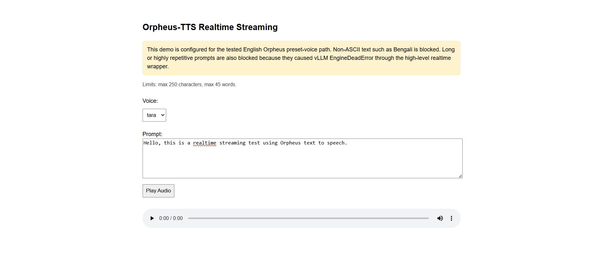

# Orpheus-TTS Execution Documentation

**Orpheus-TTS** is an LLM-based text-to-speech system using a Llama-style causal language model backend with vLLM-based inference. This document records the complete Linux server setup, execution, troubleshooting, successful single-inference result, and vLLM model-level batching/concurrency verification for Orpheus-TTS.

**Official Repository:**

```text
https://github.com/canopyai/Orpheus-TTS
```

---

## 1. System Assumptions

Tested environment:

```text
Server OS: Linux
Project path: ~/tts-testing/Orpheus-TTS
Python env: conda environment named orpheus-tts
Python: 3.10.20
GPU selected for test: NVIDIA GeForce RTX 3090
CUDA visible device: 1
NVIDIA driver: 580.126.09
System CUDA version shown by nvidia-smi: 13.0
Runtime package: orpheus-speech
vLLM: 0.20.1
PyTorch: 2.11.0+cu130
```

Important GPU mapping note:

```text
If CUDA_VISIBLE_DEVICES=1 is set, physical GPU 1 becomes logical cuda:0 inside Python/vLLM.
So seeing cuda:0 in logs is expected.
```

The server contains mixed GPUs:

```text
GPU 0: NVIDIA GeForce RTX 5090
GPU 1: NVIDIA GeForce RTX 3090
```

Because vLLM warned about mixed GPUs, stable GPU ordering was set using:

```bash
export CUDA_DEVICE_ORDER=PCI_BUS_ID
export CUDA_VISIBLE_DEVICES=1
```

---

## 2. Go to Project Folder

From the server:

```bash
cd ~/tts-testing

git clone https://github.com/canopyai/Orpheus-TTS.git
cd Orpheus-TTS
```

Create output/cache folders:

```bash
mkdir -p ./outputs ./benchmark_outputs ./gradio_tmp ./profiler_outputs
```

---

## 3. Create and Activate Python Environment

Create a fresh conda environment:

```bash
conda create -n orpheus-tts python=3.10 -y
conda activate orpheus-tts
```
---

## 4. Select GPU

Use physical GPU 1:

```bash
export CUDA_DEVICE_ORDER=PCI_BUS_ID
export CUDA_VISIBLE_DEVICES=1
```

Verify:

```bash
echo $CUDA_VISIBLE_DEVICES
```

Expected:

```text
1
```

---

## 5. Install Orpheus-TTS According to Repository

The repository-first installation path was used:

```bash
pip install --upgrade pip setuptools wheel
pip install orpheus-speech
```

No manual PyTorch installation was done before installing `orpheus-speech`.

Alternatively, install from the provided [`requirements.txt`](requirements.txt) which contains all dependencies for a complete, reproducible setup:

```bash
pip install -r requirements.txt
```

Key packages installed:

```text
orpheus-speech==0.1.0
torch==2.11.0+cu130
torchaudio==2.11.0
vllm==0.20.1
transformers==5.7.0
snac==1.2.1
```

---

## 6. Verify Python Imports

Run:

```bash
python - <<'PY'
import sys

print("python:", sys.version)
print("-" * 60)

try:
    import torch
    print("torch:", torch.__version__)
    print("cuda available:", torch.cuda.is_available())
    print("cuda device count:", torch.cuda.device_count())

    if torch.cuda.is_available():
        print("visible gpu:", torch.cuda.get_device_name(0))
except Exception as e:
    print("torch check failed:", repr(e))

print("-" * 60)

try:
    import vllm
    print("vllm:", vllm.__version__)
except Exception as e:
    print("vllm check failed:", repr(e))

print("-" * 60)

try:
    from orpheus_tts import OrpheusModel
    print("OrpheusModel import OK")
except Exception as e:
    print("OrpheusModel import failed:", repr(e))
PY
```

Observed successful output:

```text
python: 3.10.20
torch: 2.11.0+cu130
cuda available: True
cuda device count: 1
visible gpu: NVIDIA GeForce RTX 3090
vllm: 0.20.1
OrpheusModel import OK
```

A warning appeared because the server has mixed GPUs:

```text
Detected different devices in the system: NVIDIA GeForce RTX 5090, NVIDIA GeForce RTX 3090.
Please make sure to set CUDA_DEVICE_ORDER=PCI_BUS_ID to avoid unexpected behavior.
```

Fix used:

```bash
export CUDA_DEVICE_ORDER=PCI_BUS_ID
export CUDA_VISIBLE_DEVICES=1
```

After this, PyTorch confirmed:

```text
cuda available: True
cuda device count: 1
visible gpu: NVIDIA GeForce RTX 3090
```

---

## 7. Hugging Face Authentication

The Orpheus model is gated on Hugging Face.

Login:

```bash
huggingface-cli login
huggingface-cli whoami
```

The script uses:

```text
canopylabs/orpheus-tts-0.1-finetune-prod
```

During execution, Hugging Face access was required for:

```text
canopylabs/orpheus-3b-0.1-ft
```

Open the model page in a browser while logged in to Hugging Face and accept/request access:

```text
https://huggingface.co/canopylabs/orpheus-3b-0.1-ft
```

Then verify access from the server:

```bash
python - <<'PY'
from huggingface_hub import hf_hub_download

path = hf_hub_download(
    repo_id="canopylabs/orpheus-3b-0.1-ft",
    filename="config.json",
)

print("Access OK:", path)
PY
```

---

## 8. Setup Issue: PyPI Package Did Not Accept `max_model_len`

Initial repo-style execution with:

```python
from orpheus_tts import OrpheusModel
```

failed with:

```text
TypeError: OrpheusModel.__init__() got an unexpected keyword argument 'max_model_len'
```

The repository documents this kind of issue and recommends using the local package from the cloned repo.

Fix:

```python
import sys
sys.path.insert(0, "orpheus_tts_pypi")

from orpheus_tts import OrpheusModel
```

This forces Python to load:

```text
~/tts-testing/Orpheus-TTS/orpheus_tts_pypi/orpheus_tts
```

instead of the installed PyPI package.

---

## 9. Setup Issue: Gated Hugging Face Model Access

After switching to the local repository package, model loading failed with:

```text
403 Forbidden
Cannot access gated repo
Access to model canopylabs/orpheus-3b-0.1-ft is restricted and you are not in the authorized list.
```

Cause:

```text
The Hugging Face account/token used on the server did not yet have access to the required gated Orpheus model.
```

Fix:

```text
Accepted/requested access to canopylabs/orpheus-3b-0.1-ft on Hugging Face.
Then ran huggingface-cli login again on the server.
```

---

## 10. Setup Issue: Python Multiprocessing Spawn

After model access was fixed, vLLM switched multiprocessing to `spawn` because CUDA was initialized:

```text
We must use the spawn multiprocessing start method.
Overriding VLLM_WORKER_MULTIPROC_METHOD to 'spawn'.
```

The initial script created `OrpheusModel(...)` at top level and failed with:

```text
RuntimeError:
An attempt has been made to start a new process before the current process has finished its bootstrapping phase.
```

Fix:

Wrap model creation and inference inside a `main()` function:

```python
if __name__ == "__main__":
    main()
```

---

## 11. Setup Issue: vLLM GPU Memory Reservation

Execution failed during vLLM engine startup with:

```text
ValueError: Free memory on device cuda:0 (12.18/23.56 GiB) on startup is less than desired GPU memory utilization (0.92, 21.67 GiB).
Decrease GPU memory utilization or reduce GPU memory used by other processes.
```

Cause:

```text
vLLM default gpu_memory_utilization was 0.92.
On the RTX 3090, that requested about 21.67 GiB, but only about 12.18 GiB was free.
```

Fix used:

```python
model = OrpheusModel(
    model_name="canopylabs/orpheus-tts-0.1-finetune-prod",
    max_model_len=1024,
    gpu_memory_utilization=0.45,
)
```

This successfully reduced the sequence length and vLLM memory reservation.

---

## 12. Final Working Single Inference Script

File: [`test_orpheus_repo.py`](test_orpheus_repo.py)

---

## 13. Run Single Inference

Run:

```bash
cd ~/tts-testing/Orpheus-TTS
conda activate orpheus-tts

export CUDA_DEVICE_ORDER=PCI_BUS_ID
export CUDA_VISIBLE_DEVICES=1

python test_orpheus_repo.py
```

Observed successful output:

```text
It took 11.94 seconds to generate 11.26 seconds of audio
Chunks: 132
Saved: output.wav
```

Generated file:

```text
output.wav
```

---

## 14. Successful vLLM Runtime Details

Observed from successful single-inference run:

```text
Resolved architecture: LlamaForCausalLM
Downcasting torch.float32 to torch.bfloat16
Using max model len 1024
Chunked prefill is enabled with max_num_batched_tokens=2048
Asynchronous scheduling is enabled
Using FlashAttention version 2
Checkpoint size: 14.09 GiB
Model loading took 6.18 GiB memory
Available KV cache memory: 3.07 GiB
GPU KV cache size: 28,768 tokens
Maximum concurrency for 1,024 tokens per request: 28.09x
```

Generation result:

```text
Generation time: 11.94 sec
Audio duration: 11.26 sec
Chunks: 132
Output file: output.wav
```

Approximate RTF:

```text
RTF = 11.94 / 11.26 = 1.06
```

---

## 15. First-Run Time Notes

The first successful run took extra time because the model weights were downloaded and vLLM performed compilation/warmup.

Observed:

```text
Time spent downloading weights: 568.65 seconds
Checkpoint size: 14.09 GiB
Loading weights took 3.91 seconds
Model loading took 6.18 GiB memory and 576.58 seconds
torch.compile took 28.48 seconds
Initial profiling/warmup run took 0.89 seconds
init engine took 44.87 seconds
```

After model weights and compile cache are available locally, future runs should avoid the long initial download step.

---

## 16. Hugging Face Cache Location

Model files are cached under:

```bash
~/.cache/huggingface/hub/
```

Inspect:

```bash
ls -lh ~/.cache/huggingface/hub/
du -sh ~/.cache/huggingface/hub/
```

vLLM compile cache was observed under:

```text
~/.cache/vllm/torch_compile_cache/
```

---

## 17. Generated Audio Storage

The repo-style script saves:

```text
output.wav
```

Current project directory after successful run contained:

```text
output.wav
test_orpheus_repo.py
outputs/
benchmark_outputs/
gradio_tmp/
profiler_outputs/
```

If using future custom scripts, generated files can be placed under:

```bash
./outputs/
```

---

## 18. Final Working Concurrent Benchmark Script

Purpose: Benchmark concurrent TTS inference using direct async-vLLM engine calls.

Key implementation details:
- Uses `model.engine.generate(...)` instead of `model.generate_speech()` to avoid thread-safety issues
- Decodes from `output.token_ids` instead of `output.text` to get complete audio tokens

Purpose:

```text
Compare four Orpheus requests run sequentially vs four requests submitted concurrently to the same shared vLLM engine.
Validate that concurrent outputs are complete enough by comparing audio durations and chunk counts.
```

---

## 19. Run Concurrent Benchmark

Run:

```bash
cd ~/tts-testing/Orpheus-TTS
conda activate orpheus-tts

export CUDA_DEVICE_ORDER=PCI_BUS_ID
export CUDA_VISIBLE_DEVICES=1

python test_orpheus_concurrent.py
```

---

## 20. Concurrent Benchmark Result (Script)

Final successful benchmark result from `test_orpheus_concurrent.py`:

```text
Sequential wall time:  39.41s
Concurrent wall time:  14.53s
Speedup:               2.71x
Sequential throughput: 1.06 audio-sec/wall-sec
Concurrent throughput: 2.93 audio-sec/wall-sec
Output validation OK:  True
Result: Concurrent vLLM inference gives meaningful speedup with valid audio durations.
```

Sequential generation:

```text
seq 1: elapsed=9.47s, audio=9.98s, RTF=0.949, chunks=117
seq 2: elapsed=9.97s, audio=10.67s, RTF=0.935, chunks=125
seq 3: elapsed=9.97s, audio=10.58s, RTF=0.942, chunks=124
seq 4: elapsed=9.99s, audio=10.67s, RTF=0.937, chunks=125
```

Sequential summary:

```text
Sequential wall time: 39.41s
Sequential total audio: 41.90s
Sequential throughput: 1.06 audio-sec/wall-sec
Sequential avg RTF: 0.940
```

Concurrent generation:

```text
concurrent 1: elapsed=12.90s, audio=10.58s, RTF=1.219, chunks=124
concurrent 2: elapsed=13.44s, audio=10.67s, RTF=1.260, chunks=125
concurrent 3: elapsed=13.99s, audio=10.67s, RTF=1.312, chunks=125
concurrent 4: elapsed=14.53s, audio=10.67s, RTF=1.362, chunks=125
```

Concurrent summary:

```text
Concurrent wall time: 14.53s
Concurrent total audio: 42.58s
Concurrent throughput: 2.93 audio-sec/wall-sec
Concurrent avg RTF: 1.288
```

Output validation:

```text
Text 1: seq=9.98s, concurrent=10.58s, duration_ratio=1.06, seq_chunks=117, con_chunks=124
Text 2: seq=10.67s, concurrent=10.67s, duration_ratio=1.00, seq_chunks=125, con_chunks=125
Text 3: seq=10.58s, concurrent=10.67s, duration_ratio=1.01, seq_chunks=124, con_chunks=125
Text 4: seq=10.67s, concurrent=10.67s, duration_ratio=1.00, seq_chunks=125, con_chunks=125
Validation: concurrent outputs look complete enough for batching comparison.
```

Interpretation:

```text
Four requests generated about 42.58 seconds of audio in 14.53 seconds of wall time.
The concurrent run completed 2.71x faster than the sequential run.
The output durations and chunk counts matched closely, so the speedup is valid.
```

Important meaning of concurrent wall time:

```text
Concurrent wall time is the total elapsed time for all 4 concurrent requests together.
It is approximately the time of the slowest/latest finishing request, not the sum of all request times.
```

Calculation:

```text
Sequential wall time = 39.41s
Concurrent wall time = 14.53s
Speedup = 39.41 / 14.53 = 2.71x

Concurrent total audio = 42.58s
Concurrent throughput = 42.58 / 14.53 = 2.93 audio-sec/wall-sec

Effective concurrent RTF = concurrent wall time / total generated audio duration
                         = 14.53 / 42.58
                         ≈ 0.341
```

---

## 21. Concurrent Benchmark Result (Gradio UI)

Full benchmark log from the Gradio UI:

```text
Model: canopylabs/orpheus-tts-0.1-finetune-prod
Voice: tara
Run directory: /home/kawshik/tts-testing/Orpheus-TTS/benchmark_outputs/ui_seq_vs_concurrent/run_1777952877449
Number of texts: 4
Concurrency: 4
max_model_len: 1024
gpu_memory_utilization: 0.45
temperature: 0.6
top_p: 0.8
max_tokens: 900
min_tokens: 80
repetition_penalty: 1.3

Warmup...
[warmup-1777952877450269540] events=33, generated_token_ids=554, yielded_token_strings=554, fallback_text_chunks=0
Warmup done. Warmup chunks=71

==============================
Sequential async-vLLM run
==============================

Sequential item 1/4
Text: Hello, this is the first Orpheus model level batching test.
[orpheus-seq-1-1777952883737003486] events=48, generated_token_ids=382, yielded_token_strings=382, fallback_text_chunks=0
seq 1: elapsed=4.20s, audio=4.18s, RTF=1.005, chunks=49, path=/home/kawshik/tts-testing/Orpheus-TTS/benchmark_outputs/ui_seq_vs_concurrent/run_1777952877449/seq_1.wav

Sequential item 2/4
Text: This is the second request, submitted concurrently to the vLLM engine.
[orpheus-seq-2-1777952887940969388] events=49, generated_token_ids=457, yielded_token_strings=457, fallback_text_chunks=0
seq 2: elapsed=5.01s, audio=4.78s, RTF=1.048, chunks=56, path=/home/kawshik/tts-testing/Orpheus-TTS/benchmark_outputs/ui_seq_vs_concurrent/run_1777952877449/seq_2.wav

Sequential item 3/4
Text: The third request checks whether model level batching improves wall time.
[orpheus-seq-3-1777952892948464370] events=55, generated_token_ids=415, yielded_token_strings=415, fallback_text_chunks=0
seq 3: elapsed=4.52s, audio=4.18s, RTF=1.081, chunks=49, path=/home/kawshik/tts-testing/Orpheus-TTS/benchmark_outputs/ui_seq_vs_concurrent/run_1777952877449/seq_3.wav

Sequential item 4/4
Text: The fourth request measures total wall time and audio throughput.
[orpheus-seq-4-1777952897470752172] events=47, generated_token_ids=388, yielded_token_strings=388, fallback_text_chunks=0
seq 4: elapsed=4.29s, audio=4.18s, RTF=1.025, chunks=49, path=/home/kawshik/tts-testing/Orpheus-TTS/benchmark_outputs/ui_seq_vs_concurrent/run_1777952877449/seq_4.wav

--- Sequential Summary ---
Sequential wall time: 18.02s
Sequential total audio: 17.32s
Sequential throughput: 0.96 audio-sec/wall-sec
Sequential effective RTF: 1.040
Sequential avg per-request RTF: 1.040

==============================
Concurrent async-vLLM run: concurrency=4
==============================
[orpheus-concurrent-1-1777952901758587511] events=32, generated_token_ids=374, yielded_token_strings=374, fallback_text_chunks=0
[orpheus-concurrent-3-1777952901760986366] events=31, generated_token_ids=451, yielded_token_strings=451, fallback_text_chunks=0
[orpheus-concurrent-4-1777952901761760158] events=31, generated_token_ids=340, yielded_token_strings=340, fallback_text_chunks=0
concurrent 1: elapsed=7.32s, audio=3.84s, RTF=1.907, chunks=45, path=/home/kawshik/tts-testing/Orpheus-TTS/benchmark_outputs/ui_seq_vs_concurrent/run_1777952877449/concurrent_1.wav
concurrent 3: elapsed=8.17s, audio=4.78s, RTF=1.710, chunks=56, path=/home/kawshik/tts-testing/Orpheus-TTS/benchmark_outputs/ui_seq_vs_concurrent/run_1777952877449/concurrent_3.wav
concurrent 4: elapsed=8.41s, audio=3.58s, RTF=2.346, chunks=42, path=/home/kawshik/tts-testing/Orpheus-TTS/benchmark_outputs/ui_seq_vs_concurrent/run_1777952877449/concurrent_4.wav
[orpheus-concurrent-2-1777952901760190554] events=32, generated_token_ids=607, yielded_token_strings=607, fallback_text_chunks=0
concurrent 2: elapsed=8.42s, audio=5.80s, RTF=1.451, chunks=68, path=/home/kawshik/tts-testing/Orpheus-TTS/benchmark_outputs/ui_seq_vs_concurrent/run_1777952877449/concurrent_2.wav

--- Concurrent Summary ---
Concurrent wall time: 8.42s
Concurrent total audio: 18.01s
Concurrent throughput: 2.14 audio-sec/wall-sec
Concurrent effective/system RTF: 0.468
Concurrent avg per-request RTF: 1.854

==============================
Output Duration Validation
==============================
Text 1: seq=4.18s, concurrent=3.84s, duration_ratio=0.92, seq_chunks=49, con_chunks=45
Text 2: seq=4.78s, concurrent=5.80s, duration_ratio=1.21, seq_chunks=56, con_chunks=68
Text 3: seq=4.18s, concurrent=4.78s, duration_ratio=1.14, seq_chunks=49, con_chunks=56
Text 4: seq=4.18s, concurrent=3.58s, duration_ratio=0.86, seq_chunks=49, con_chunks=42
Validation: concurrent outputs look complete enough for batching comparison.

==============================
Final Comparison
==============================
Sequential wall time:       18.02s
Concurrent wall time:       8.42s
Speedup:                    2.14x
Sequential throughput:      0.96 audio-sec/wall-sec
Concurrent throughput:      2.14 audio-sec/wall-sec
Sequential effective RTF:   1.040
Concurrent effective RTF:   0.468
Output validation OK:       True
Result: Concurrent vLLM inference gives meaningful speedup with valid audio durations.
```

---

## 22. Gradio UI

File: [`orpheus_benchmark_ui.py`](orpheus_benchmark_ui.py)

Purpose:

```text
A browser UI for Orpheus-TTS inference with single-text generation and concurrent benchmarking capabilities.
```



Run:

```bash
cd ~/tts-testing/Orpheus-TTS
conda activate orpheus-tts

export CUDA_DEVICE_ORDER=PCI_BUS_ID
export CUDA_VISIBLE_DEVICES=1

python orpheus_benchmark_ui.py
```

Then open:

```text
http://YOUR_SERVER_IP:6020
```


---

## 23. Realtime Streaming Flask Example

File: [`realtime_streaming_example/main.py`](realtime_streaming_example/main.py)

Purpose:

```text
Run a lightweight Flask-based realtime streaming demo for Orpheus-TTS.
The endpoint streams WAV audio from the high-level Orpheus generate_speech() path.
```



Run:

```bash
cd ~/tts-testing/Orpheus-TTS/realtime_streaming_example
conda activate orpheus-tts

export CUDA_DEVICE_ORDER=PCI_BUS_ID
export CUDA_VISIBLE_DEVICES=1

python main.py
```

The Flask server was configured to run on:

```text
http://YOUR_SERVER_IP:6021
```
---

## 24. Realtime Streaming Notes

The Flask realtime server (see [`realtime_streaming_example/main.py`](realtime_streaming_example/main.py)) streams audio using the high-level `generate_speech()` wrapper.

**Working case**: Short English prompts work well.

**Known issues**:
- Non-ASCII text (Bengali) causes `EngineDeadError`
- Long repetitive prompts can kill the vLLM EngineCore
- Requires ~12–14 GiB free VRAM for `gpu_memory_utilization=0.45`

The `main.py` includes guardrails:
- Blocks non-ASCII input, long prompts, repetitive text
- Uses `max_tokens=900`, `repetition_penalty=1.3`, `temperature=0.6`
- Runs with `threaded=False` to avoid naive concurrent calls

If GPU memory is insufficient on startup:

```bash
nvidia-smi
pkill -f "python main.py"
pkill -f "orpheus_benchmark_ui.py"
pkill -f "test_orpheus"
```

## 25. Common Warnings and Meanings

### Mixed GPU warning

```text
Detected different devices in the system: NVIDIA GeForce RTX 5090, NVIDIA GeForce RTX 3090.
Please make sure to set CUDA_DEVICE_ORDER=PCI_BUS_ID to avoid unexpected behavior.
```

Fix:

```bash
export CUDA_DEVICE_ORDER=PCI_BUS_ID
export CUDA_VISIBLE_DEVICES=1
```

### NIXL warning

```text
NIXL is not available
NIXL agent config is not available
```

This did not block successful inference.

### Multiprocessing spawn warning

```text
We must use the spawn multiprocessing start method.
```

This required the script to use:

```python
if __name__ == "__main__":
    main()
```

### BPE tokenizer warning

```text
Ignoring clean_up_tokenization_spaces=True for BPE tokenizer TokenizersBackend.
```

This warning did not block successful inference.

### Raw prompt deprecation warning

```text
Passing raw prompts to InputProcessor is deprecated and will be removed in v0.18.
```

This warning did not block successful inference or batching verification.

### NCCL destroy warning on exit

```text
destroy_process_group() was not called before program exit
```

This appeared after successful output generation and did not prevent WAV files from being created.

---

## 26. Final Result Summary

Single inference:

```text
Status: Successful
Output file: output.wav
Model: canopylabs/orpheus-tts-0.1-finetune-prod
Underlying gated access required: canopylabs/orpheus-3b-0.1-ft
Runtime: vLLM 0.20.1
Architecture: LlamaForCausalLM
GPU: NVIDIA GeForce RTX 3090
Max model length used: 1024
GPU memory utilization used: 0.45
Audio duration: 11.26 sec
Generation time: 11.94 sec
Chunks: 132
Approximate RTF: 1.06
```

Concurrent benchmark:

```text
Status: Successful
Concurrent requests: 4
Sequential wall time: 39.41 sec
Concurrent wall time: 14.53 sec
Speedup: 2.71x
Sequential throughput: 1.06 audio-sec/wall-sec
Concurrent throughput: 2.93 audio-sec/wall-sec
Output validation: True
```

---

## Prepared By
**Kawshik Kumar Paul**  
Software Engineer | Researcher  
Department of Computer Science and Engineering (CSE)  
Bangladesh University of Engineering and Technology (BUET)  
**Email:** kawshikbuet17@gmail.com